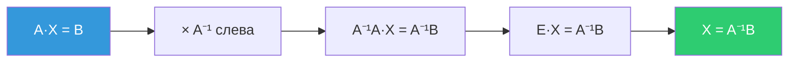

# Миноры, алгебраические дополнения, обратная матрица, правило Крамера

> [!abstract]+ 🎯 План лекции
> 1. 🔲 **Миноры** и **алгебраические дополнения**
> 2. 📐 **Разложение определителя** по строке или столбцу
> 3. 🔄 **Обратная матрица** и её вычисление
> 4. ✏️ **Правило Крамера** для системы 3×3
> 5. 🧮 **Матричный метод** решения систем

## 📑 Оглавление
- [[#🔲 1. Минор]]
- [[#➕ 2. Алгебраическое дополнение]]
- [[#📐 3. Разложение определителя]]
- [[#✏️ 4. Пример: вычислить определитель]]
- [[#🔄 5. Обратная матрица]]
- [[#🧪 6. Пример: найти обратную матрицу]]
- [[#✏️ 7. Правило Крамера]]
- [[#🧮 8. Матричный метод]]
- [[#⚖️ 9. Сравнение методов]] · [[#📖 Термины]] · [[#🧠 Самопроверка]]

---

## 🔲 1. Минор

Пусть дана матрица третьего порядка:

$$A=\begin{pmatrix} a_{11}&a_{12}&a_{13}\\ a_{21}&a_{22}&a_{23}\\ a_{31}&a_{32}&a_{33}\end{pmatrix}$$

> [!info] 📌 Определение
> **Минором** $M_{ij}$ матрицы $A$ к элементу $a_{ij}$ называется **определитель**, который получается **вычёркиванием $i$-й строки и $j$-го столбца**.

**Пример.** Для $M_{23}$ вычёркиваем 2-ю строку и 3-й столбец:

$$M_{23}=\begin{vmatrix} a_{11}&a_{12}\\ a_{31}&a_{32}\end{vmatrix}$$

---

## ➕ 2. Алгебраическое дополнение

> [!important] 🧮 Формула
> **Алгебраическое дополнение** $A_{ij}$ к элементу $a_{ij}$:
> $$A_{ij}=(-1)^{i+j}\,M_{ij}$$

Знак зависит от суммы номеров строки и столбца — «шахматка» знаков:

$$\begin{pmatrix} + & - & + \\ - & + & - \\ + & - & + \end{pmatrix}$$

- Если $i+j$ **чётно** ➜ знак $+$ ($A_{ij}=M_{ij}$)
- Если $i+j$ **нечётно** ➜ знак $-$ ($A_{ij}=-M_{ij}$)

---

## 📐 3. Разложение определителя

Вычисление определителей **разложением по строкам и столбцам**.

> [!success] 🎓 Теорема
> **Определитель матрицы равен сумме произведений элементов строки (столбца) на соответствующие им алгебраические дополнения.**

### Разложение по 3-й строке

$$|A|=a_{31}A_{31}+a_{32}A_{32}+a_{33}A_{33}$$

Раскрываем алгебраические дополнения:

$$|A|=a_{31}(-1)^{3+1}\begin{vmatrix} a_{12}&a_{13}\\ a_{22}&a_{23}\end{vmatrix}+a_{32}(-1)^{3+2}\begin{vmatrix} a_{11}&a_{13}\\ a_{21}&a_{23}\end{vmatrix}+a_{33}(-1)^{3+3}\begin{vmatrix} a_{11}&a_{12}\\ a_{21}&a_{22}\end{vmatrix}$$

Считаем определители 2×2:

$$|A|=a_{31}(a_{12}a_{23}-a_{22}a_{13})-a_{32}(a_{11}a_{23}-a_{21}a_{13})+a_{33}(a_{11}a_{22}-a_{12}a_{21})$$

> [!tip] ✅ Итоговая формула определителя 3×3
> $$|A|=a_{11}a_{22}a_{33}+a_{12}a_{23}a_{31}+a_{13}a_{21}a_{32}-a_{13}a_{22}a_{31}-a_{11}a_{23}a_{32}-a_{12}a_{21}a_{33}$$
> Это правило **треугольников** (Саррюса), получившееся из разложения.

> [!note] 💡 Как выбирать строку
> Раскладывать удобнее по строке или столбцу, где **больше нулей**: слагаемые с нулевым элементом отпадают.

---

## ✏️ 4. Пример: вычислить определитель

$$\begin{vmatrix} 1&2&3\\ 4&5&0\\ 6&3&1\end{vmatrix}$$

Разложение по **2-му столбцу** (элементы 2, 5, 3):

$$=2\cdot(-1)^{1+2}\begin{vmatrix}4&0\\6&1\end{vmatrix}+5\cdot(-1)^{2+2}\begin{vmatrix}1&3\\6&1\end{vmatrix}+3\cdot(-1)^{3+2}\begin{vmatrix}1&3\\4&0\end{vmatrix}$$

$$=-2\cdot4+5\cdot(1-18)-3\cdot(0-12)=-8-85+36=-57$$

> [!warning] ⚠️ Проверь итог в тетради
> В тетради этот пример записан с другим итогом: слагаемые $-8$, $-85$ и третье сходятся с моим расчётом только по первым двум. Верный ответ, который получается и по правилу треугольников, и по разложению: $\mathbf{-57}$.

---

## 🔄 5. Обратная матрица

> [!info] 📌 Определение
> Матрица $A^{-1}$ называется **обратной** к матрице $A$, если
> $$A^{-1}\cdot A=A\cdot A^{-1}=E$$
> где $E$ — **единичная** матрица.

### Формула для матрицы 3-го порядка

> [!important] 🧮
> $$A^{-1}=\frac{1}{|A|}\begin{pmatrix} A_{11}&A_{21}&A_{31}\\ A_{12}&A_{22}&A_{32}\\ A_{13}&A_{23}&A_{33}\end{pmatrix}$$

- Матрица из алгебраических дополнений **транспонирована**: $A_{ij}$ ставится на место $(j,i)$ (обратите внимание на порядок индексов в строках)
- Обратная матрица существует **только если $|A|\ne 0$**

### Алгоритм
1. Найти $|A|$ (если $0$ ➜ обратной нет)
2. Найти все **9 алгебраических дополнений** $A_{ij}$
3. Составить матрицу из них и **транспонировать**
4. Умножить на $\dfrac{1}{|A|}$
5. **Проверить:** $A^{-1}\cdot A=E$

---

## 🧪 6. Пример: найти обратную матрицу

**Задача.** Найти матрицу, обратную данной, и выполнить проверку.

$$A=\begin{pmatrix} -1&2&0\\ 4&3&-2\\ 6&5&1\end{pmatrix}$$

> [!warning] ⚠️ Про элемент $a_{33}$
> В тетради нижний правый элемент читается как «−1», но все вычисления ($A_{11}=13$, $|A|=-45$) соответствуют $a_{33}=1$. Проверь по учебнику или по условию задачи.

### Шаг 1. Определитель (разложение по 1-й строке)

$$|A|=-1\begin{vmatrix}3&-2\\5&1\end{vmatrix}-2\begin{vmatrix}4&-2\\6&1\end{vmatrix}+0=-13-32=-45$$

### Шаг 2. Алгебраические дополнения

| | Столбец 1 | Столбец 2 | Столбец 3 |
|---|---|---|---|
| **Строка 1** | $A_{11}=13$ | $A_{12}=-16$ | $A_{13}=2$ |
| **Строка 2** | $A_{21}=-2$ | $A_{22}=-1$ | $A_{23}=17$ |
| **Строка 3** | $A_{31}=-4$ | $A_{32}=-2$ | $A_{33}=-11$ |

Как считали (примеры):
- $A_{11}=+\begin{vmatrix}3&-2\\5&1\end{vmatrix}=3+10=13$
- $A_{12}=-\begin{vmatrix}4&-2\\6&1\end{vmatrix}=-(4+12)=-16$
- $A_{13}=+\begin{vmatrix}4&3\\6&5\end{vmatrix}=20-18=2$
- $A_{21}=-\begin{vmatrix}2&0\\5&1\end{vmatrix}=-2$
- $A_{22}=+\begin{vmatrix}-1&0\\6&1\end{vmatrix}=-1$
- $A_{23}=-\begin{vmatrix}-1&2\\6&5\end{vmatrix}=-(-5-12)=17$
- $A_{31}=+\begin{vmatrix}2&0\\3&-2\end{vmatrix}=-4$
- $A_{32}=-\begin{vmatrix}-1&0\\4&-2\end{vmatrix}=-2$
- $A_{33}=+\begin{vmatrix}-1&2\\4&3\end{vmatrix}=-3-8=-11$

### Шаг 3. Обратная матрица

$$A^{-1}=\frac{1}{-45}\begin{pmatrix} 13&-2&-4\\ -16&-1&-2\\ 2&17&-11\end{pmatrix}$$

### Шаг 4. Проверка $A^{-1}\cdot A=E$

$$-\frac{1}{45}\begin{pmatrix} 13&-2&-4\\ -16&-1&-2\\ 2&17&-11\end{pmatrix}\cdot\begin{pmatrix} -1&2&0\\ 4&3&-2\\ 6&5&1\end{pmatrix}=-\frac{1}{45}\begin{pmatrix} -45&0&0\\ 0&-45&0\\ 0&0&-45\end{pmatrix}=\begin{pmatrix} 1&0&0\\ 0&1&0\\ 0&0&1\end{pmatrix}$$

> [!success] ✅ Проверка сошлась: получили единичную матрицу $E$.

---

## ✏️ 7. Правило Крамера

Рассмотрим **систему трёх уравнений с тремя неизвестными**:

$$\begin{cases} a_{11}x+a_{12}y+a_{13}z=b_1\\ a_{21}x+a_{22}y+a_{23}z=b_2\\ a_{31}x+a_{32}y+a_{33}z=b_3\end{cases}$$

### Определители

**Главный определитель** — из коэффициентов при неизвестных:

$$\Delta=|A|=\begin{vmatrix} a_{11}&a_{12}&a_{13}\\ a_{21}&a_{22}&a_{23}\\ a_{31}&a_{32}&a_{33}\end{vmatrix}$$

**Вспомогательные** — в главном определителе **столбец при неизвестной заменяется столбцом свободных членов** $b$:

$$\Delta_x=\begin{vmatrix} b_1&a_{12}&a_{13}\\ b_2&a_{22}&a_{23}\\ b_3&a_{32}&a_{33}\end{vmatrix}\quad \Delta_y=\begin{vmatrix} a_{11}&b_1&a_{13}\\ a_{21}&b_2&a_{23}\\ a_{31}&b_3&a_{33}\end{vmatrix}\quad \Delta_z=\begin{vmatrix} a_{11}&a_{12}&b_1\\ a_{21}&a_{22}&b_2\\ a_{31}&a_{32}&b_3\end{vmatrix}$$

> [!important] 🧮 Формулы Крамера
> $$x=\frac{\Delta_x}{\Delta}\qquad y=\frac{\Delta_y}{\Delta}\qquad z=\frac{\Delta_z}{\Delta}$$
> Работает **только при $\Delta\ne0$**.

### Пример

$$\begin{cases} 3x+2y+z=5\\ x+y-z=0\\ 4x-y+5z=3\end{cases}$$

**Главный определитель** (разложение по 1-му столбцу):

$$\Delta=\begin{vmatrix} 3&2&1\\ 1&1&-1\\ 4&-1&5\end{vmatrix}=3\begin{vmatrix}1&-1\\-1&5\end{vmatrix}-1\begin{vmatrix}2&1\\-1&5\end{vmatrix}+4\begin{vmatrix}2&1\\1&-1\end{vmatrix}=12-11-12=-11$$

**$\Delta_x$** (1-й столбец заменён на $(5,0,3)$):

$$\Delta_x=\begin{vmatrix} 5&2&1\\ 0&1&-1\\ 3&-1&5\end{vmatrix}=5\begin{vmatrix}1&-1\\-1&5\end{vmatrix}+3\begin{vmatrix}2&1\\1&-1\end{vmatrix}=20-9=11$$

**$\Delta_y$** (2-й столбец заменён на $(5,0,3)$):

$$\Delta_y=\begin{vmatrix} 3&5&1\\ 1&0&-1\\ 4&3&5\end{vmatrix}=-33$$

**$\Delta_z$** (3-й столбец заменён на $(5,0,3)$):

$$\Delta_z=\begin{vmatrix} 3&2&5\\ 1&1&0\\ 4&-1&3\end{vmatrix}=-22$$

**Решение:**

$$x=\frac{11}{-11}=-1\qquad y=\frac{-33}{-11}=3\qquad z=\frac{-22}{-11}=2$$

> [!success] ✅ Проверка подстановкой
> - $3\cdot(-1)+2\cdot3+2=5$ ✓
> - $-1+3-2=0$ ✓
> - $4\cdot(-1)-3+5\cdot2=3$ ✓
>
> **Ответ:** $(x,y,z)=(-1,\;3,\;2)$

---

## 🧮 8. Матричный метод

Решение системы уравнений с помощью обратной матрицы.

Обозначим:

$$A=\begin{pmatrix} a_{11}&a_{12}&a_{13}\\ a_{21}&a_{22}&a_{23}\\ a_{31}&a_{32}&a_{33}\end{pmatrix}\quad X=\begin{pmatrix} x\\y\\z\end{pmatrix}\quad B=\begin{pmatrix} b_1\\b_2\\b_3\end{pmatrix}$$

Система записывается как **матричное уравнение** $A\cdot X=B$.

Умножаем обе части **слева** на $A^{-1}$:

$$A^{-1}A\,X=A^{-1}B$$

$$E\cdot X=A^{-1}B\;\Longrightarrow\;\boxed{X=A^{-1}B}$$

> [!warning] ⚠️ Порядок умножения
> Матрицы **не коммутативны**: $A^{-1}$ умножаем на $B$ **слева**, то есть $A^{-1}B$, а не $BA^{-1}$.

---

## ⚖️ 9. Сравнение методов

| Метод | Идея | Когда удобен | Условие |
|---|---|---|---|
| **Разложение определителя** | $\sum a_{ij}A_{ij}$ по строке или столбцу | вычислить определитель | — |
| **Обратная матрица** | $A^{-1}=\frac{1}{\lvert A\rvert}\cdot(A_{ji})$ | нужна сама $A^{-1}$ | $\lvert A\rvert\ne0$ |
| **Правило Крамера** | $x=\Delta_x/\Delta$ и т. д. | небольшие системы | $\Delta\ne0$ |
| **Матричный метод** | $X=A^{-1}B$ | несколько систем с одной $A$ | $\lvert A\rvert\ne0$ |

---

## 📖 Термины

- 🔲 **Минор $M_{ij}$** — определитель после вычёркивания $i$-й строки и $j$-го столбца
- ➕ **Алгебраическое дополнение $A_{ij}$** — $(-1)^{i+j}M_{ij}$
- 📐 **Разложение определителя** — сумма произведений элементов строки (столбца) на их алгебраические дополнения
- 🔄 **Обратная матрица $A^{-1}$** — $A^{-1}A=AA^{-1}=E$
- 🧱 **Единичная матрица $E$** — единицы на диагонали, остальные нули
- ✏️ **Правило Крамера** — решение системы через отношение определителей
- 🧮 **Матричный метод** — решение $AX=B$ формулой $X=A^{-1}B$

---
