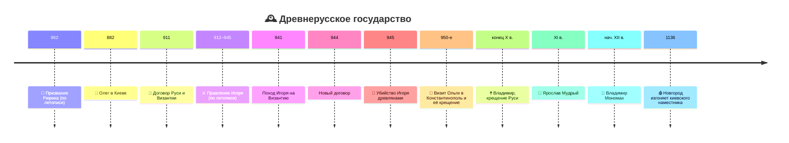

# Древнерусское государство (IX–XII вв.)

> [!abstract]+ 🎯 О чём лекция
> 1. 📅 **Периодизация** развития Древней Руси
> 2. ⚔️ **Норманнская теория** и как на неё смотрят сегодня
> 3. 🛶 **Скандинавы и торговый путь** — как возникло государство
> 4. 👑 **Первые князья:** Олег, Игорь, Ольга
> 5. 🏛️ **Русь и Византия** — отношения и путь к крещению

> [!todo] 📝 Задание от преподавателя
> В конце пары — **листок с 10 вопросами к теме** (не ответы, не «что не поняла», а именно вопросы по теме). Указать **фамилию и группу**. 5 минут на оформление в конце пары. Можно писать по ходу лекции.
> - Один из вопросов может быть на **дату** («в каком году Олег занял Киев?»).
> - Это подтверждение присутствия и **дополнительные баллы**.

## 📑 Оглавление
- [[#🗓️ 1. Периодизация]]
- [[#🧩 2. Политическая раздробленность]]
- [[#⚔️ 3. Норманнская теория]]
- [[#🛶 4. Скандинавы и Волжский путь]]
- [[#🏗️ 5. Чего не было у раннего государства]]
- [[#👑 6. Первые князья]]
- [[#🏛️ 7. Русь и Византия]]
- [[#✝️ 8. Путь к крещению]]
- [[#🗓️ Хронология]] · [[#👤 Персоналии]] · [[#📖 Термины]] · [[#🧠 10 вопросов к теме]]

---

## 🗓️ 1. Периодизация

> [!info] 🧭 Система координат
> История развивается в связке ==**пространство + время**==. Не понимаешь территорию — путаешься в событиях; не понимаешь время — путаешься в этапах. Эта «система координат» должна быть всегда.

Доисторический период («образ грезы», предыстория) **сознательно вынесен за скобки**.

| # | Этап | Время | Суть |
|---|---|---|---|
| 1️⃣ | 🌱 **Складывание государства** | сер. IX — сер. X вв. | Первые князья: **Олег, Игорь, Ольга**, отчасти Святослав. Из «разрозненных пазлов» складывается картинка |
| 2️⃣ | 🌟 **Расцвет Руси** | конец X — 1-я пол. XI вв. | **Владимир Великий** и **Ярослав Мудрый**: с Владимира можно говорить о государстве «в полном объёме»; Ярослав — кодификация права, каменные соборы, развитие христианства |
| 3️⃣ | 👑 **Мономах** | начало XII в. | Собрал земли заново; легитимность никто не оспаривал; но не сумел закрепить наследование от отца к сыну |
| 4️⃣ | 🧩 **Политическая раздробленность** | сер. XII — сер. XIII вв. | Земли обособляются, заявляют свои претензии |

> [!note] 🕰️ Эпоха Ярослава — кульминация?
> Не совсем: после его смерти начались **междоусобицы сыновей**, **половецкая угроза**. Но это были **несколько десятилетий стабильности**, за которые Русь накопила **силы и экономический потенциал**, давший рост в следующий период.

---

## 🧩 2. Политическая раздробленность

### 🗺️ Как это видно на картах
- Единая закрашенная территория ➜ **набор разноцветных земель**
- Земли закреплены **за сыновьями Владимира**: Новгород и Киев — у старшего сына, Чернигов — у второго, Переяславль и Ростово-Суздальская земля — у третьего, Смоленск — у четвёртого и так далее
- Территории на карте местами **пересекаются** по цвету (один сын — несколько земель)

### 🔄 Центростремительный → центробежный процесс
- На первом этапе Владимир и Ярослав **по кусочку собирали земли** вокруг Киева и Новгорода
- Затем — **обратный (центробежный) процесс**: «кусочки», слабо державшиеся единой властью, при ослаблении и политических недоразумениях «уплывают в свободное плавание»
- К концу XII — середине XIII вв. земли **окончательно обособились**

### 👑 Мономах и лествичное право
- Владимир **Мономах** (нач. XII в.) — иногда **незаслуженно в тени** Ярослава Мудрого
- Ему удалось собрать русские земли, легитимность его власти не оспаривалась
- **Не удалось:** передавать власть **от отца к сыну** (классическая монархия) вместо **лествичного права** (от брата к брату)
- ➜ с середины XII в. начинается раздробленность

> [!danger] 🩸 Точка отсчёта — 1136 год
> **Новгородцы изгнали киевского наместника.** Когда киевский князь настаивал на своём сыне в наместники, новгородцы «с издёвкой» ответили: *если у сына две головы — пусть приезжает* (одну отрубим, а вторая останется). Намёк: власть Киева больше терпеть не будут.

### 💰 Парадокс: политический распад, но экономический расцвет
> [!success] 🌟 XII — начало XIII в. — время наивысшего благосостояния
> Признаки:
> - рост **городов** — по количеству и территории
> - находки **ремесленных изделий**, торговля
> - огромное количество **каменных храмов** (нужны мастера, деньги, товар — стройка энерго- и финансово затратна)
>
> ➜ Русь **не была в упадке**, несмотря на политическую самостоятельность земель.

> [!failure] ⚠️ Ловушка
> У Руси **не было единого внешнего врага**. Обычно государства объединяются перед внешней угрозой, а здесь «каждый жил в своём соку». Когда в южных степях появились монголы, **единого фронта не получилось** — и нашествие «поставило жирный крест» на древнерусской истории.

---

## ⚔️ 3. Норманнская теория

### 📜 Исходная информация
По летописи (**Повесть временных лет**) в ==**862 г.**== славяне **призвали Рюрика с дружиной**: «нет порядка в земле нашей, приди и владей».

### 🕰️ Три волны спора

| Эпоха | Вопрос | Что происходило |
|---|---|---|
| **XVIII в.** | Кто такой **Рюрик** — скандинав или славянин? | Немецкие учёные, первыми прочитавшие летопись, заключили: пришли **варяги**, основали династию. Летопись прямо называет Рюрика **скандинавом-варягом** |
| **Середина XVIII в.** | «Швед или русский?» | **Ломоносов** возражает — не по источникам, а по **политической целесообразности**: при императрице Елизавете России **воюет со шведами** — как признать основателем династии скандинава? Придумал версию, что Рюрик — **славянин с южной Балтики** |
| **XIX в.** | Вопрос почти снят | Археология: **скандинавское оружие, шлемы, топоры** — как в Швеции. Историкам ясно: Рюрик — скандинав. Это не подрывало устои государства |
| **Середина XX в.** | «Создали ли скандинавы государство?» | После войны с нацистской Германией «германская» основа русской истории стала **политически опасной**. Советские историки доказывали: государство создали **исключительно славяне**, Рюрика призвали «на готовое» |

> [!quote] 🎓 Современная позиция
> - Вопрос «**могли ли скандинавы создать государство**» — ответ «нет, не могли»
> - Правильный вопрос: **какую роль сыграли скандинавы** и какие условия сложились для государства
> - Норманнская теория давно ушла из **научной гипотезы** в **научно-популярную** плоскость
> - Мы вынуждены учитывать **разные факторы**, а не выкидывать скандинавский элемент (влияния, традиции были на Руси очень сильны)

> [!tip] 🧠 Важно для семинара
> Государство **нельзя привнести извне**: общество должно **дозреть**, а потом срабатывает «рубильник» — государственные элементы начинают формироваться ускоренно.

---

## 🛶 4. Скандинавы и Волжский путь

### 🗺️ География: почему викинги освоились на Руси
- Балтика ➜ **Финский залив** ➜ **Нева** ➜ **Ладожское озеро** ➜ река **Свирь** ➜ **Онежское озеро**; где не проплыть — **волоки** (перетаскивали суда)
- Широкая Нева напоминала родные **фьорды и шхеры**
- 🌊 **Вода для древних — не преграда, а главная магистраль.** Сухопутных дорог нет: леса, болота; товар (керамика, продовольствие) не довезти

**Центры скандинавов:** Новгород, Ладога, Белоозеро.

### 🕵️ «Два лица» викингов
| Западная Европа | Восточная Европа (Русь) |
|---|---|
| 🗡️ **Разбойники**, грабители | 💼 **Купцы** |
| Слово **«вик»** — военный поход; высадка, грабёж, возвращение с добычей | Нет смысла жечь деревни: славяне **сожгут ладью**; славян несколько тысяч, викингов десятки |
| Мореплаватели: дошли до Исландии, Гренландии, Америки (~1000 г.) | Богатеют **без насилия** |

### 💰 Волжский торговый путь (Волго-Донской)
> [!important] 🏦 Первый «транснациональный торговый коридор»
> **Серебро** из арабского халифата перекачивалось в **Западную Европу**.
>
> **Почему серебро так важно:** из него чеканили монеты. Европейские серебряные рудники (ещё со времён античности) к VIII–IX вв. **истощились**, а в халифате серебра было много.

**Маршрут:** Балтика ➜ Нева/Ладога ➜ **Волга и Дон** ➜ **Каспий** ➜ арабские страны.

| Что везли на юг | Что везли на север |
|---|---|
| 🗡️ Оружие (мечи) | 💰 **Серебро** |
| 🦊 Пушнина (соболь, белка, горностай) | |
| 🍯 Мёд, воск | |
| ⛓️ Невольники | |

**Славяне** поставляли товар (мёд, воск, невольники, пушнину); **скандинавы** обеспечивали транспорт (ладьи) и военную охрану караванов.

### 📈 Результаты для славян
1. Славянские племена **попали в орбиту скандинавской торговли**
2. Внутри племён идёт **социальное расслоение**: вождь, жрец, старейшины, удачливые охотники ➜ верхушка получает выгоду
3. **Клады серебра** (закапывали как накопление и как дар языческим богам) чётко **картографируются** вдоль Волги и Дона до Новгорода и Ладоги

### 🔍 Что стоит за призванием Рюрика
> [!example] 🎬 Реконструкция (по лекции)
> 1. **Бизнес-план** работает: скандинавы и славяне торгуют с халифатом
> 2. Летопись (двумя абзацами выше) сообщает, что варягов **изгнали**
> 3. Причина — конфликт интересов («кто-то счёл условия невыгодными»)
> 4. Но **без варягов богаче не стало**: славяне сами до халифата не доплывут, поток товаров иссяк
> 5. Славянская верхушка **зовёт варягов обратно**: «вы нам обеспечите поток товаров, мы вам — политическую стабильность»
> 6. **862 г.** — приходит Рюрик с дружиной, начинается новый этап
>
> Современные историки: зашифрованный в летописи период — **~10–15 лет**, несколько конфликтов и пауза.

> [!success] 🧪 Доказательство: клады
> Клады серебра в Западной Европе: **VIII век и 1-я половина IX века**, потом **пауза**, и снова с **конца IX века** — поток серебра прерывался и восстановился. Это совпадает с летописным сюжетом.

### 🧱 Вывод: роль варягов
> [!important] ⚙️ Катализатор
> - Славянская общность **дозрела** до государства, но не хватало **экономического импульса**
> - Варяги стали **«последним пазлом»** — катализатором
> - Они **не были носителями государственной идеи** (её не было тогда ни в Швеции, ни в Норвегии, ни в Дании); такие же **воинственные вожди племён**, но лучше организованные и вооружённые
> - Волжский путь давал **прибыль**, варяги — **функционирование пути**, славяне — **транзитную территорию**
> - Позже (X — начало XI вв.) серебро иссякает, рудники вырабатываются ➜ главным путём станет **«из варяг в греки»**

---

## 🏗️ 5. Чего не было у раннего государства

При Рюрике **нет признаков государства**: армия, законы, территория, налоги, монета, культурная традиция.

| Признак | Как было |
|---|---|
| 🗺️ **Территория** | Не единая: три очага — **Киев–Чернигов**, **Новгород–Ладога** (север), **Ростово-Суздальская** (Средняя Волга); между ними **болота и леса**, связь затруднена |
| 💰 **Налоги** | Нет схемы (пример — смерть Игоря) |
| 🪙 **Монета** | Нет единой. Обмен: **шкурки, «вещи»**, серебряные **слитки-гривны** (монеты переплавляли — удобнее считать на вес) |
| ⚔️ **Армия** | Нет как системы |

> [!bug] 🐺 Смерть князя Игоря (945)
> Игорь собрал дань с **древлян**, на обратном пути ему показалось мало — и он **вернулся второй раз**. Древляне: *если волк повадился к овцам — перетаскает всё стадо, проще убить.* Убили. ➜ Не было **закона и схемы обложения**: «раз в год приду, вы отдадите» ➜ регулирования не существовало.

Эти атрибуты начнут собираться в эпоху **Владимира и Ярослава**.

---

## 👑 6. Первые князья

### 🗡️ Олег
- **882 г.** — новгородский князь **Олег** высадился в Киеве и **обманом захватил власть** (по Киевской летописи). Новгородская летопись описывает иначе: **Игорь**, уже взрослый, сам пришёл в Киев без Олега.
- Фигура Олега **не совсем легендарна**: где молчит русская история, помогают **соседи**. **Арабские источники** рассказывают о русах-купцах, приходивших с пушниной и мечами; **византийские источники** тоже говорят о Руси.

### 📜 Договор с Византией — 911 г.
> [!important] 📌 Самый достоверный фрагмент «Повести временных лет»
> - **911 г.** — первый договор Руси и Византии (регулировал торговлю русских купцов в Константинополе)
> - Договору предшествовал **поход**. Летопись ярко описывает: ладьи на колёсах, щит на воротах Царьграда — это **легенда**
> - **Византийские источники о таком походе молчат**
> - В ПВЛ вошли **три договора** (911, 944 и ещё один), все — **только в Киевской редакции** летописи
>
> **Почему договоры считаются подлинными:**
> - написаны **сухим, юридическим языком**: перечень статей, без «тигров и змей в голову»
> - в русском тексте видны **ошибки «лоб в лоб» перевода** с греческого (транскрипция греческих слов вместо русских аналогов) ➜ перед нами **оригинальный русский текст** перевода с греческого
> - греческие оригиналы **не сохранились**

> [!note] 🧠 Как читать летопись
> Специалист видит ПВЛ как **слоёный пирог**: ранняя версия, поздние вставки. Князь в начале XII в. дал летописцу **княжеский архив, документы, договоры, воспоминания** — и заказал «летопись русского народа». Договоры вставили **дословно**.

> [!tip] ⚖️ Был ли поход?
> Возможно, был, но **не такой сокрушительный**: византийцы часто **откупались**; император мог заплатить **выкуп**, чтобы не жгли столицу, и договориться о торговле. Летописец **разукрасил** победу (колёса, щиты, «20 тонн серебра»).

### ⚔️ Игорь
- Правление по летописи — **912–945**
- Известен походом на Византию: византийцы **отбили** поход, **сожгли русский флот**; затем Игорь заключил **новый договор на менее выгодных условиях** (**944**)
- Убит **древлянами** (**945**)

> [!question] 🕳️ Пустые строки
> В ПВЛ под годами правления Игоря (около **30 лет**) — **пустые строки**: летописец расписал даты, но событий не нашёл, а **придумывать не стал**. Рассказ идёт про 941, 944, 945 гг. Некоторые историки считают, что Игорь правил всего 3 года, но это «гиперкритицизм».

### 👸 Ольга
- **Уникальность:** во главе государства — **женщина**. В IX–X вв. жена **не наследовала** имущество мужа (были случаи, когда жён убивали вместе с князьями).
- Почему правила: был **малолетний Святослав** — она мать будущего законного князя. Хотя Русь мог возглавить любой мужчина из рода Игоря, «но Ольга стала единой».
- Отомстила **древлянам** за смерть мужа.
- **50-е гг. X в.** — **визит в Константинополь**: приём на высоком уровне, **несколько личных встреч с императором**. Визит — «вершина айсберга»: предварительные переговоры, согласованные даты.
- Русь при Ольге — **уже не просто варварские племена**, а **государство**, лидер которого признан императором (не равным, но тем, **с кем можно садиться за стол переговоров**).
- **Ольга крестилась в Константинополе** — индивидуально, лично.

---

## 🏛️ 7. Русь и Византия

> [!warning] ⚠️ Не союзники, а противники (до Владимира)
> В традиции: Русь и Византия — союзники. Но **до эпохи Владимира** это **отношения врагов**.

- 🔁 **Цикл:** поход на Константинополь ➜ конфликт ➜ договор (~каждые 30 лет)
- Походы: **Олег, Игорь, Владимир, Ярослав Мудрый** (тоже ходил на Константинополь)
- 💰 **Экономика** сглаживала конфликт: Византии выгодно, чтобы русы привозили **воск, пушнину, невольников**; Русь ещё и **закупала товары** в Константинополе

---

## ✝️ 8. Путь к крещению

> [!important] 🎯 Как Русь получила христианство
> Не «дружеский шаг» Византии, а ==**Русь взяла силой то, чем Византия делиться не хотела**==.

### 🛡️ Византийская позиция
- Православие Византия **оберегала**: делились на **ромеев** (православные византийцы, «римляне») и **варваров** (германцы, славяне, арабы)
- «Мы избранные, у нас православие»

### 🎬 Сюжет с Владимиром
1. В Византии **гражданская война**, повстанцы **осаждают столицу**
2. Император просит **военной помощи** у **Владимира** в Киеве
3. Владимир: помогу, **но хочу византийскую царевну в жёны и хочу креститься**
4. Император согласился (детали, последовательность, **Корсунская легенда** — на семинарах)

> [!success] 🌍 Итог
> - Огромная территория Восточной Европы **вошла в идеологическую орбиту Константинополя** — геополитический прорыв
> - **Византийские источники молчат** о крещении Руси: для Византии это было **поражение**, их вынудили поделиться самым сокровенным с «варварами», постоянно нападавшими
> - Позже приезжают **миссионеры**, распространяются **летописание, иконы**
> - **Ольга** — «предтеча»: она крестилась **лично**; Владимир **крестил Русь**

> [!quote] 💬 Аналогия лектора
> Отдали 5 рублей самостоятельно — или их у вас отобрали на улице: результат тот же, но ситуации разные. Так и с крещением: Русь получила то, что **потребовала**, а не то, что хотел дать Константинополь.

---

## 🗓️ Хронология

| 📅 Год | 📌 Событие |
|---|---|
| **862** | Призвание Рюрика (по ПВЛ) |
| **882** | Олег в Киеве |
| **911** | Первый договор Руси и Византии |
| **912–945** | Правление Игоря (по летописи) |
| **941** | Поход Игоря на Византию |
| **944** | Новый договор на менее выгодных условиях |
| **945** | Смерть Игоря у древлян |
| **950-е** | Визит и крещение Ольги |
| **конец X — 1-я пол. XI** | Владимир и Ярослав — расцвет |
| **нач. XII** | Владимир Мономах |
| **1136** | Новгородцы изгоняют киевского наместника — начало раздробленности |
