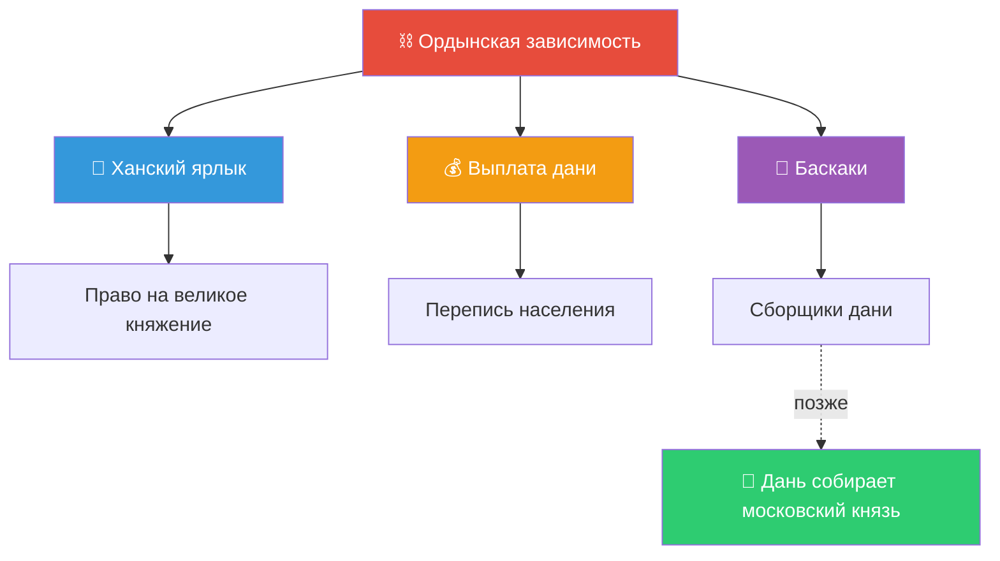
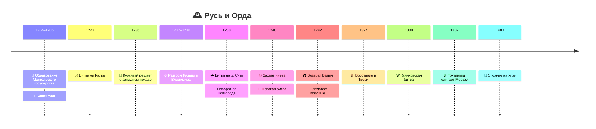

# Русь в XIII–XV веках: ордынская зависимость и возвышение Москвы

> [!abstract]+ 🎯 О чём лекция
> Две большие подтемы:
> 1. 🐎 **Ордынская зависимость и её специфика**
> 2. 🌟 **Возвышение Москвы** и складывание Московского государства
>
> Это **введение** перед семинаром в пятницу (монгольское нашествие и ордынское влияние).

> [!info] 🧭 Главная идея
> После катастрофы нашествия **«на старом фундаменте»** собирается **Русь 2.0 — Московская Русь** ➜ Московское княжество ➜ Московское государство ➜ Российское государство.
> 
> ⚠️ Рамка XIII–XV вв. «очень искусственная» — жизнь в XIII и XV веках сильно отличалась, поэтому удобнее мыслить **блоками**.

## 📑 Оглавление
- [[#🏞️ 1. Русь до нашествия]]
- [[#🐎 2. Монгольская империя]]
- [[#🔥 3. Нашествие 1237–1240]]
- [[#💔 4. Последствия]]
- [[#⛓️ 5. Ордынская зависимость]]
- [[#⚖️ 6. Не только «иго»]]
- [[#🎭 7. Три типа походов]]
- [[#🌟 8. Возвышение Москвы]]
- [[#🛡️ 9. Александр Невский]]
- [[#🏁 10. Освобождение]]
- [[#🗓️ Хронология]] · [[#👤 Персоналии]] · [[#📖 Термины]] · [[#🧠 Самопроверка]]

---

## 🏞️ 1. Русь до нашествия

### 🧩 Раздробленность: «плюс» и «минус»
| | Что |
|---|---|
| ➖ **Минус** | нет единого политического центра |
| ➕ **Плюс** | ==экономический рост== — города богатеют, земли развиваются |

**Княжества:** Полоцкое, Смоленское, Черниговское, Турово-Пинское, Галицкое, Волынское — и три **главных для темы**:

| 🗺️ Земля | ⭐ Значение |
|---|---|
| 🟦 **Владимиро-Суздальская** | сильнейшее княжество ➜ ядро будущей Москвы |
| 🟩 **Новгородская** | богатая торговая земля, особая модель власти |
| 🟥 **Рязанская** | пограничье, приняла первый удар |

> [!success] 🕊️ Что скрепляло Русь
> ==Единая религия== (православие) и ==единая культура==. Человек, переехав из одного княжества в другое, не попадал в чужую среду.

> [!note] 😴 Период затишья
> Внешней угрозы не было, «каждый жил в своё удовольствие, пока не грянула гроза».

### ⚡ Первый звоночек — битва на Калке, **1223**
- Южнорусские степи, [[Битва на Калке]]
- 🔴 Русские князья **разбиты**
- 🔍 Но монголы **не ставили цель покорить Русь** — это **разведпоход**
- ⏳ Русь получила передышку ~15 лет

---

## 🐎 2. Монгольская империя

### 🌱 Возникновение
- **1204–1206** — Забайкалье, ядро монгольского этноса
- Власть переходит к 👑 **[[Чингисхан|Чингисхану]]** (междоусобная борьба, кого-то убили, кто-то подчинился)
- ⚡ За **~20 лет** покорена почти вся Евразия

> [!question] ❓ Как это возможно?
> - Монголы — прежде всего **кочевники**, без «высокой идеи государственности»
> - На первом этапе — ==беспощадные завоеватели==
> - 🇨🇳 Пал Китай, 🕌 Средняя Азия, Ближний Восток, Иран
> - К 30-м гг. XIII в. — контроль над ==всеми торговыми путями Евразии==
> - 🚫 Не покорены: **Индия** (Гималаи, Тибет) и **Япония**

> [!example] 🌊 Камикадзе — «божественный ветер»
> Монгольский флот уже погрузился на корабли для **десанта в Японию** — но налетел шторм и разметал суда. По-японски **камикадзе = божественный ветер** (а не только «лётчики-смертники»). 🇯🇵 Япония осталась непокорённой.

### 🧠 «Монголы» — собирательный образ
- Монголы-татары = отдельные племена, влившиеся в единое ядро
- 🧑‍🤝‍🧑 **Покорённые народы** включались в мобилизацию и воевали дальше
- 🛠️ Инженеры, осадные орудия, корабли — ==от китайцев==
- 👑 Монголы позиционировали себя как **элиту-кочевников**, ремесленники и инженеры — «на подхвате»

> [!important] 🎯 Ключевой вывод
> Нашествие — это **не набег** «печенегов-кочевников пограбить». Это ==хорошо спланированная операция== с **разведкой**: когда и куда бить. Монголы под видом купцов бывали на Руси; князья думали: «они где-то воюют, нас не касается».

### 🧱 Границы империи
> [!warning] ⚠️ Русь НЕ входила в Монгольскую империю!
> ==Русь никогда не входила территориально в состав империи==. В завоёванных землях сидели монгольские династии и наместники. Русь же оказалась **в зависимости** от соседа, контролировавшего земли **«от Тихого океана до Чёрного моря»**.
>
> ✏️ **Ордынская зависимость ≠ монгольское нашествие** — не синонимы!

### 🧩 Распад и Золотая Орда
- Огромная империя без централизованной практики ➜ **распад на улусы**
- 🎯 Для Руси важна ==[[Золотая Орда]]==, центр — 🏙️ **[[Сарай]]** на Нижней Волге (район современной Астрахани)
- Происходящее в Каракоруме Русь касалось мало

---

## 🔥 3. Нашествие 1237–1240

### 🗓️ Подготовка
- **1235** — курултай решает о западном походе
- ❄️ Выбрали **зиму**: летом реки полноводны, весной и осенью — грязь, а зимой ==замёрзшие реки — «магистрали» для конницы==
- **1236** — пала **Волжская Булгария** ➜ юго-восточная граница Руси открыта

### 🗺️ Ход событий

| 📅 Дата | 💥 Событие |
|---|---|
| ❄️ **дек. 1237** | 🟥 Удар по **Рязани**. Город разрушен так, что новая Рязань возникла за десятки км от старой |
| ❄️ **янв.–февр. 1238** | 🟦 **Владимиро-Суздальская земля**. Князь бежал собирать войска, оставив оборону сыну; помощи нет. Владимир взят после осады (~неделя) |
| ⚔️ **1238** | Битва на **реке Сить** — разгром остатков владимирских войск |
| 🔥 1238 | Пали Москва, Ярославль, Кострома, Суздаль; не убежавшие убиты |
| 🌧️ **март 1238** | Поход к 🟩 **Новгороду** — монголы **разворачиваются**: весенняя распутица превратит землю в болото и «конница окажется в западне». Разграблены лишь пограничные центры |
| 🏕️ 1238–1239 | Отдых и перегруппировка в южнорусских степях |
| 💥 **1239–1240** | Южные княжества: Переяславль, Чернигов, **Киев** (захвачен в конце 1240) |
| 🌍 после 1240 | Запад: Галиция-Волынь, Польша, Чехия, Венгрия, выход к **Адриатике** |
| 🏠 **1242** | **Батый** узнаёт о смерти великого хана, начинается борьба за власть — он возвращается в Поволжье |

### ❓ Почему Русь проиграла
> [!failure] 💔 Причина — разобщённость
> - Монгольский корпус ~**150 тыс.** («не маленькие цифры, но и не астрономические»)
> - Русские княжества **могли выставить сопоставимое войско**
> - Но каждое жило своей жизнью, ==никто никому не помогал==, идеи единой армии не было
> - Итог: ==разбиты поодиночке== 😞

> [!tip] 🌦️ Погода решала
> Климат и распутица определяли ход кампаний (разворот от Новгорода). Аналогично — апрельский лёд Чудского озера у Невского.

---

## 💔 4. Последствия

За **3 года** (дек. 1237 – дек. 1240):
- 🔥 сожжены **все крупные города**
- ⚔️ уничтожены **княжеские дружины**
- 📚 в огне пропали **тысячи памятников письменности**, иконы, книги
- ⛓️ **угнаны ремесленники** ➜ встало производство (например, ювелирное)
- 🧱 **~50 лет заглохло каменное строительство** — мастера убиты или угнаны
- 💰 цель монголов — ==военная добыча и грабёж==, а не территориальный контроль

> [!quote] 🏛️ Монголы ≠ арабы для Европы
> Через **арабов** Европа получила достижения медицины, астрономии, математики. Монголы **не принесли** ни науки, ни государственной идеи — на первом этапе они ==исключительно завоеватели==, которым нужна нажива.

---

## ⛓️ 5. Ордынская зависимость и её специфика

> [!abstract] ⏳ 200 лет!
> Для сравнения: СССР — ~70 лет. За такой срок нельзя описать всё одним словом «иго».

### 📜 5.1. Ханский ярлык
- Выдавался **только одному князю — на великое княжение**. Он номинально возглавлял русские земли.
- В остальных княжествах власть передавалась **по прежним русским правилам — лествичному праву**. Монголы **не вмешивались**.
- 😏 Монголам даже нравилось **дробление**: отец делит землю между тремя сыновьями ➜ из одного княжества три. «Вы дань платите, а как между собой разбираетесь — ваше дело».

> [!important] 🚫 Наместников на Руси не было!
> В Китае и Средней Азии во главе единиц стояли **монгольские наместники**. На Руси — **нет** ➜ ==политическая автономия==.

**🎁 Как получали ярлык:**
1. Ехать в Орду и просить
2. 🎁 Обязательно **богатые подарки**
3. ⏳ Хан мог держать князя **неделями и месяцами**, проверяя лояльность
4. 👦 Могли потребовать **сыновей в заложники**
5. ✅ В **~90%** ярлык получал тот, у кого было право по русской традиции (из рода великих князей Владимирских); **~10%** — «зазор» для исключений

Ярлык — ==подтверждение легитимности== власти князя.

### 💰 5.2. Выплата дани
- Самое тяжёлое: деньги, которые могли идти в экономику, **уходили на сторону**. «Ничего хорошего не было».
- На первом этапе дань **чётко определена**: монголы провели **перепись** (сколько осталось мужчин) и назначили сумму каждому городу, земле, деревне.

### 🧾 5.3. Баскаки
- **Баскак** — главный ордынский сборщик дани
- Позже сбор и выплату возьмёт на себя ==московский князь==

> [!tip] 💡 Финансовый механизм
> Кто аккумулирует ресурс — тот может его **придержать, прокрутить, выплачивать траншами** и получить «зазор».
> ➜ Москва получила право собирать дань = **колоссальный финансовый рычаг**.
> 😔 Простым людям легче не стало: они платили как прежде, просто дань теперь оседала в Москве.

### ⛪ 5.4. Религиозная политика
- Монголы **веротерпимы** (язычники до принятия ислама в начале XIV в.)
- ⛪ **Церковь освобождена от налогов и выплат**
- 🗣️ Русский язык и культуру **не запрещали**
- Жестокость к церквям — период самого нашествия; веротерпимость — **позднейший этап**

---

## ⚖️ 6. Не только «иго»

> [!warning] 🎨 Тезис лектора
> Отношения Руси и Орды **никогда не были «чёрно-белыми»**. Говорим о ==взаимоотношениях и взаимовлиянии==, а термин **«иго»** — в кавычках.

- 👘 **Заимствования** с Востока: одежда, имена, правила поведения
- ⚖️ **Хан как третейский судья** — князья сами шли в Орду, чтобы хан рассудил споры (как призвание Рюрика: «не можем сами — зовём третьего»)
- 🧊 **Парадокс:** зависимость стала **«консервантом»** — сохранились культура, религия и династии ➜ на новом этапе Русь возродилась
- 🔨 **Жёсткость осталась:** попытка выйти из подчинения ➜ быстрый карательный удар
- 🌱 Эти 200 лет — время ==переосмысления, переформирования, накопления сил==

> [!example] 📊 Считаем набеги
> **~30 набегов** за 200 лет (нециклично). А сокрушительных, лично инициированных ханом — всего **5–7**. 📉 Градус конфликта сразу ниже, чем кажется.

---

## 🎭 7. Три типа походов

> [!summary] 🎬 Не все «нашествия» одинаковы
> | # | Тип | Пример |
> |---|---|---|
> | 1️⃣ | 👑 Поход **легитимного хана** | Тохтамыш, 1382 |
> | 2️⃣ | 🦹 Поход **самозванца / местного военачальника** | Мамай, 1380 |
> | 3️⃣ | 🤝 Отряды, **приглашённые русскими князьями** | помощь в междоусобицах |

### 🎯 Мамай vs Тохтамыш
- 🦹 **Мамай** — темник (командир 10 тыс.), **самозванец**, претендовал на власть в Орде. Законный хан — 👑 **Тохтамыш**.
- ⚔️ **Куликовская битва, **1380****: Дмитрий Донской разбил Мамая.
- 😮 Парадокс: ==больше всех выиграл Тохтамыш==, не ударив пальцем о палец — его соперник устранён.
- 🔥 **1382** (через два года): «А дань где?» Москва отказалась ➜ поход, **сожжение Москвы**, дань возобновлена.

> [!success] 🏆 Значение Куликовской битвы
> - Впервые Москва собрала под знамёна **почти все дружины русских городов** под командованием **одного князя**
> - ⛪ Церковь поддержала
> - 📚 Породила массу литературных памятников
> - 🥇 **Главная победа Дмитрия Донского — политическая:** хан разрешил ==передавать ярлык по наследству== без поездки в Орду
> - Москва закрепила это право в **90-х гг. XIV в.**

---

## 🌟 8. Возвышение Москвы

### ⚔️ Тверь vs Москва
Начало XIV в. — главные соперники: **Тверь** 🆚 **Москва**. Тверь по перспективам была даже интереснее!

> [!danger] 🩸 Тверское восстание (**1327**)
> 1. 😡 Баскаки в Твери **безобразничали** — обижали жителей, требовали лишнего
> 2. 🕊️ Князь **Александр** призывал: «потерпите, заплатим — уйдут»
> 3. 💥 Тверичи не выдержали ➜ **баскаки и ордынцы перебиты**
> 4. Князь **возглавил** выступление — отказаться от воли народа не мог

**Ответ хана:** карательный поход.
🎭 И тут — ход **Ивана Калиты**: он сам пришёл в Орду и предложил **военную помощь** против Твери, дав свои дружины.

> [!success] 🏆 Итог
> Тверь **разгромлена** и не оправилась (осталась «полусамостоятельной»). ==Москва закрепила право на великое княжение==.

### 🎰 «Лотерея» с ярлыком
- По русской традиции ярлык могли получить только **дети великого князя**
- 👤 **Даниил Александрович** (сын Невского) — московский князь, но **великим не был**
- ➜ его сын **Юрий Данилович** по правилам **не имел права**
- 🏃 Но Юрий был очень активен: ездил в Орду, привозил богатые подарки
- 🎉 На фоне ухудшения отношений с Тверью ярлык **неожиданно достался ему**
- Это те самые «10% исключений». Дальше Москва, а не Тверь, Смоленск или Владимир, стала центром объединения земель.

### 🔄 Парадокс московской политики
| Этап | Позиция Москвы |
|---|---|
| 🤝 **1-я пол. XIV в.** (Юрий, Калита) | Действует **в русле ордынской политики** |
| ⚔️ **2-я пол. XIV в.** (Дмитрий Донской) | **Главный оппонент** Орды |
| 🏁 **XV в.** (Иван III) | Окончательный выход из зависимости |

> [!tip] 🚀 Факторы возвышения Москвы
> 1. 💰 Право собирать дань ➜ финансовый рычаг
> 2. 🧠 Грамотное использование ресурса
> 3. 🤝 Лояльность Орде на первом этапе
> 4. 👑 Наследственная передача ярлыка после Куликова

---

## 🛡️ 9. Александр Невский

### 👤 Кто он
**Александр Ярославич**, князь Владимирский, прозвище ==«Невский»==. Отец — **Ярослав** (получил ярлык на великое княжение, был отравлен). Жил недолго, но сделал много.

### ⚔️ Северо-западный фронт
- 🌊 **Невская битва (**1240**)** — победа над шведами; отсюда прозвище. Ему ~19 лет, пригласили новгородцы.
- 🧊 **Ледовое побоище (**5 апреля 1242**)** — победа над немецкими рыцарями на Чудском озере. Апрель — уже весна, лёд мягкий.
- ✅ Итог: сохранили самостоятельность **Новгород и Псков**.

### 🏛️ Новгородская модель
- **Республика** (вече), вышла из подчинения Киеву ещё в XII в.
- 💎 Реальная власть — **300 богатейших семей («300 золотых поясов»)**, купцы, бояре, духовенство
- Князь — **«вывеска» и военачальник по договору**: выполнил задачу, получил плату, «свободен». Сильный князь Новгороду не нужен.

### 🛤️ Три пути Александра

> [!important] 🚦 Выбор
> | Путь | Решение |
> |---|---|
> | 🤝 **Сотрудничество с Ордой** | ✅ выбрал |
> | 🔥 **Антиордынское восстание** | ❌ самоубийство для Руси |
> | ✝️ **Союз с Западом** (католичество, корона от папы, помощь в крестовом походе) | ❌ отказался (в отличие от **Даниила Галицкого**, принявшего корону) |

**Что сделал:**
- принял ярлык, **не мстил** за смерть отца
- допустил **перепись** и баскаков
- отказался от короны и протектората папы
- понимал: ещё один поход = **катастрофа**

**Почему не Запад:**
- католическая церковь стремилась **подчинять светскую власть**
- религия — основа мировоззрения эпохи; Орда ==не запрещала православие== и освободила церковь от налогов

> [!quote] 🎭 Парадокс
> Князь-воин, бьющий шведов и немцев, с Ордой выбирает ==путь дипломатии==. Это сохранило условия для **роста русской государственности**.

---

## 🏁 10. Освобождение

- Из «ига» (в кавычках) в XV в. вырастает ==единое централизованное государство==
- 👑 **Иван III** — «собиратель» — выходит из зависимости **без крупного конфликта**
- 🌊 **Стояние на реке Угре, **1480****: две армии на разных берегах несколько дней «постояли, покричали через речку» и **разошлись без боя** ➜ ==окончательное освобождение==
- 📐 Куликово **1380** ➜ конец дани **1480** = **~100 лет** «вялотекущего конфликта/неконфликта» (платим — не платим, карательные походы)

---

## 🗓️ Хронология

| 📅 Год | 📌 Событие |
|---|---|
| 1204–1206 | 🐎 Монгольское государство, власть у Чингисхана |
| 1223 | ⚔️ [[Битва на Калке]] |
| 1235 | 📣 Курултай: решение о западном походе |
| 1236 | Падение Волжской Булгарии |
| дек. 1237 | 🟥 Удар по Рязани |
| 1238 | 🟦 Владимир, р. Сить, разворот от Новгорода |
| 1240 | Захват Киева; 🌊 Невская битва |
| 1242 | Батый возвращается; 🧊 Ледовое побоище |
| 1327 | 🩸 Восстание в Твери |
| 1380 | 🏆 [[Куликовская битва]] |
| 1382 | 🔥 Тохтамыш сжигает Москву |
| 1480 | 🏁 [[Стояние на Угре]] |
